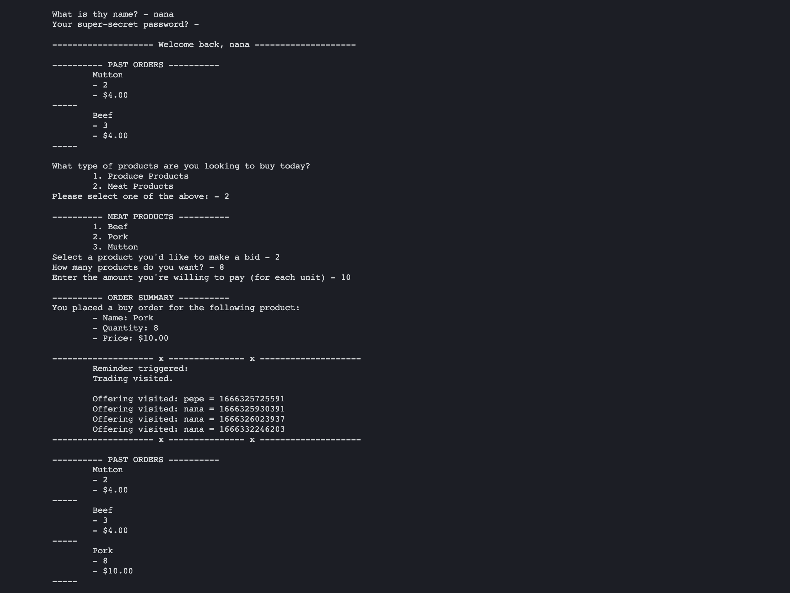

# Assignment: Design Patterns (individual)

## How To

This is a command-line application for the Product Trading and Bidding System **(PTBS)**.
*[Main.java](https://github.com/smungole/SER515-Fall22-Individual/blob/main/design-patterns/Main.java)* is the entry point.

If you wish to use a different set of users and products for the system, go to *[design-patterns/data](https://github.com/smungole/SER515-Fall22-Individual/tree/main/design-patterns/data)* directory and update the file contents for *[BuyerInfo.txt](https://github.com/smungole/SER515-Fall22-Individual/blob/main/design-patterns/data/BuyerInfo.txt)*, *[SellerInfo.txt](https://github.com/smungole/SER515-Fall22-Individual/blob/main/design-patterns/data/SellerInfo.txt)*, and *[ProductInfo.txt](https://github.com/smungole/SER515-Fall22-Individual/blob/main/design-patterns/data/ProductInfo.txt)*.

*[UserProduct.txt](https://github.com/smungole/SER515-Fall22-Individual/blob/main/design-patterns/data/UserProduct.txt)* is the output file generated from running the application.

**Commands:**

- change directory - `cd /path/to/design-patterns`
- compile and run - `javac Main.java && java Main`

**Runtime:**

- JavaSE 11
- Tested on MacOS

## What to Expect

The flow of the application is as follows:

Steps|Success|Failure
---|---|---
The user is asked to log in user their credentials|User was found|Retry with different credentials
The user can see their past orders (if any)||Nothing is displayed as no previous orders present in the database
The user is asked to select a product category|Products from selected category are displayed|Default Produce Product type is selected for invalid input
The user is asked to select a product from the given list|Order placed successfully|Invalid option selection, try again later
Lastly, the output of visitor design pattern is displayed||

This process keeps repeating until the user terminated the application

### Output

## Implemented Design Patterns

Following is the implementation of five design patterns into the Product Trading and Bidding System **(PTBS)**. The five design patterns, which are implemented within the PTBS systems, are **Façade, Bridge, Factory Method, Iterator, and Visitor**. In the following sections, a brief description of the patterns and the detailed implementation of the patterns is presented.

### 1. Façade

The **Façade** pattern can make the task of accessing many modules much simpler by providing an additional interface layer. In the implementation of the PTBS system, the façade lies in the top of all the interfaces and modules. The façade object provides a single interface to the more general facilities of other subsystems. The benefits offered by façade are as follows.

1. It shields the subsystem components to the PTBS system. For example, in the PTBS system, the main function does not have to deal with all the subsystem components. Instead, it just passes the control to the façade object and the façade object wraps up all the subsystem components.
2. The façade object eliminates the dependencies between objects.

**Relevant files:**

- [Main.java](https://github.com/smungole/SER515-Fall22-Individual/blob/main/design-patterns/Main.java)
- [Facade.java](https://github.com/smungole/SER515-Fall22-Individual/blob/main/design-patterns/facade/Facade.java)

### 2. Bridge

The **Bridge** pattern affects the load menu option in the PTBS system. When a user logs in, the bridge will help to load the appropriate menu for either buyer or seller. Furthermore, the menu should be different depending on which kind of product is selected, i.e., meat or produce product. This feature is implemented by bridge pattern.

In the bridge that is implemented in PTBS, the ProductMenu is the implementor class hierarchy, which has two subclasses named MeatProductMenu and ProduceProductMenu, and the Person is the abstraction class hierarchy which has two subclasses named Seller and Buyer. The benefits of bridge pattern are that the implementation is not bound permanently to an interface. The implementation of an abstraction can be configured at runtime. For example, the ‘real’ user interface of the ProductMenu is configured at runtime depends on the type of the product (meat product or produce product) and the type of the user (buyer or seller). And it is easy to extend the functionality that could be done by the load menu option. For example, if one other type of user or product is added, we can extend the abstraction (person) or implementor (productMenu) accordingly and independently. Without a Bridge, we would have to instantiate 4 subclasses for two kinds of user and two kinds of products. Even worse, if we add a new type of product, we will have to add two subclasses for both seller and buyer.

**Relevant files:**

- [design-patterns/person](https://github.com/smungole/SER515-Fall22-Individual/tree/main/design-patterns/person)
- [design-patterns/menu](https://github.com/smungole/SER515-Fall22-Individual/tree/main/design-patterns/menu)

### 3. Factory

The **Factory** Method pattern enables the subclasses to decide which class to instantiate. In the PTBS system, the Factory Method pattern is implemented when the ProductMenu is loaded. The ProductMenu depends on product category and user type. The Factory Method will determine which class to instantiate.

The benefit of the Factory Method is to eliminate the need to bind application-specific classes into the code. The code only deals with the Product interface (ProductMenu in this system), so it can deal with any ConcreteProduct class (MeatProductMenu and ProduceProductMenu in this system).

**Relevant files:**

- [design-patterns/person](https://github.com/smungole/SER515-Fall22-Individual/tree/main/design-patterns/person)
- [design-patterns/menu](https://github.com/smungole/SER515-Fall22-Individual/tree/main/design-patterns/menu)

### 4. Iterator

The **Iterator** pattern is implemented as a means for distributing the grade report for the buyers. The Iterator class defines an interface for accessing the list’s elements without exposing its internal structure. The OfferingIterator is implemented as an Iterator to the OfferingList class. It simplifies the Aggregate interface and supports variations in the traversal of an aggregate.

**Relevant files:**

- [design-patterns/offering](https://github.com/smungole/SER515-Fall22-Individual/tree/main/design-patterns/offering)
- [Iterator.java](https://github.com/smungole/SER515-Fall22-Individual/blob/main/design-patterns/util/Iterator.java)
- [PTBSList.java](https://github.com/smungole/SER515-Fall22-Individual/blob/main/design-patterns/util/PTBSList.java)

### 5. Visitor

The purpose of the **Visitor** Pattern is to encapsulate an operation that you want to perform on the elements of a data structure. In this way, you can change the operation being performed on a structure without the need to change the classes of the elements that you are operating on. Using a Visitor pattern allows you to decouple the classes for the data structure and the algorithms used upon them.

The benefit of Visitor is that Visitor makes adding new operation easy. Each node in the data structure "accepts" a Visitor, which sends a message to the Visitor, which includes the node's class. The visitor will then execute its algorithm for that element. In our implementation of the PTBS system, ReminderVisitor provides the Visitor capacity.

- [design-patterns/visitor](https://github.com/smungole/SER515-Fall22-Individual/tree/main/design-patterns/visitor)
- [Trading.java](https://github.com/smungole/SER515-Fall22-Individual/blob/main/design-patterns/offering/Trading.java)
- [Facade.java](https://github.com/smungole/SER515-Fall22-Individual/blob/main/design-patterns/facade/Facade.java)

### Class Diagram

Integrated all the patterns mentioned in the previous sections and all other classes that are used in the implementation of PTBS system to make the Class Diagram for the entire system.

